# FFTOceanWave_by_DirectX_11
技术博客：https://blog.csdn.net/qq_52007228/article/details/119519084

说明：这个是FFT海面波浪模拟的DirectX11版本

[Uniry](https://github.com/Li-ZhuoHang/FFTOceanWave_by_Unity)的版本请看[Li-ZhuoHang/FFTOceanWave_by_Unity (github.com)](https://github.com/Li-ZhuoHang/FFTOceanWave_by_Unity)

### 先看效果：

##### FFTOceanWave_Fog_Wireframe:


##### FFTOceanWave_Fog_noWireframe:


##### FFTOceanWave_noFog_Wireframe:


##### FFTOceanWave_noFog_noWireframe:


### 总览：

#### FFTWavesRender

FFTWavesRender的设计如下：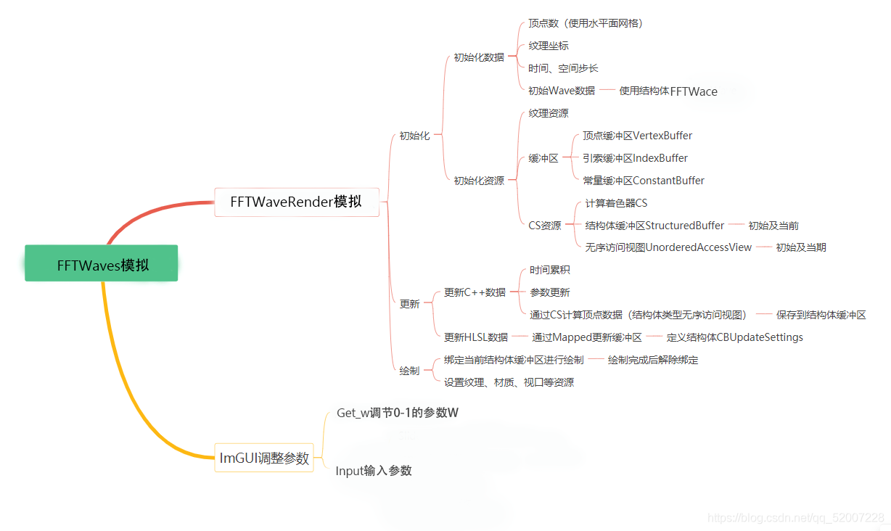

计算着色器（Computer Shader）中可以使用线程组并行进行计算，很适合用来计算波浪（水面、地形等）的顶点数据。在学习完DirectX11 With Windows 计算着色器：波浪（水波）后，要求完成FTT 海面模拟,并且可以使用 imgui 调节参数控制波浪大小。

FFTWaves
在《【学习笔记】Unity 基于GPU FFT海洋的实现-理论篇》FFT函数：
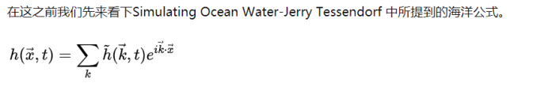

其中， 

参数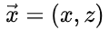是我们水平方向的坐标, t 是时间，函数 h 可以直接给我们返回在时间 t 时，

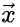处的海面高度。 

被定义为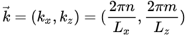

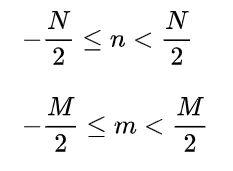

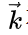为波矢量， 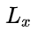和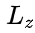是海平面的大小， N 和 M 是我们采样离散点的数量。当然 N 和 M取值越大我们得到的波形就更加细节(叠加的波就更多)，当然计算时间也会大大的增加。

我们只需要计算出频谱然后按照 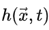函数就可以得到我们海面的高度,现在我们来看一下频谱公式 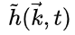

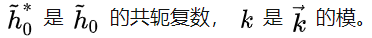

g 是引力常数 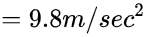

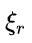和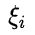 是两个相互独立服从均值为0，标准差为1的高斯随机数。

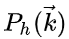是我们的方向波谱，方向波谱一般描述为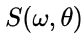 ,这和我们前面的参数不太一样，其实他们之间可以相互转换，有兴趣可以看Empirical Directional Wave Spectra for Computer Graphics这篇论文。 

 方向波谱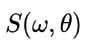是非定向波普 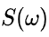和方向拓展函数 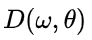的乘积


W 是我们前面提到的角频率， 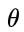是波矢量相对于风向的角度

在Simulating Ocean Water-Jerry Tessendorf 中使用到的非定向波谱为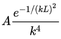 ,而方向拓展函数为 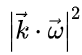,他们的乘积就是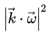

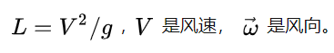

在我们的实现中风向拓展函数使用的不是 ，而是Donelan-Banner定向传播，这里就先不贴这个公式了，免得 显得公式太多....

以上FFT海面高度的公式，接下来是水平偏移

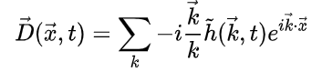

可以看到这和我们的高度函数基本一样，只是我们需要把频谱进行改变一下。这是对 X 和 Z 总体的描述，我们将其拆开就可以得到对 X　和　Z　单独的描述

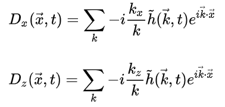

### HLSL

在上一部分了解到，我们需要获得每个波的角频率ｗ**、**波长ｋ**、**海平面的大小**L.x、Ｌ.y、**高斯随机数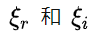**、**风向的角度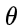和系统的时间**t**。此外，为了在计算[着色器](https://so.csdn.net/so/search?q=着色器&spm=1001.2101.3001.7020)中计算imgui ，我们还需要知道列线程组的数目。知道了需要，我们就可以在FFT`Waves.hlsli`中定义结构体： 

```
struct FFTWave
{
    float g_WaveＷ;     // 角频率
    float g_WaveＫ;     // 波长
    float g_WaveＸ; 　　// 海平面的大小
    float g_WaveＹ;     // 海平面的大小
    float g_WaveR;    　//高斯随机数
    float g_WaveI;    　//高斯随机数
    float2 g_angle;   　// 风向的角度

　　float2 g_WaveD;  　　// 方向
    float2 g_pad;       // 打包
};
```

我们要计算顶点的数据，需要在FFTWaves.hlsli中定义顶点的结构体：

```
struct VertexPosNormalTex
{
    float3 PosL : POSITION;
    float3 NormalL : NORMAL;
    float2 Tex : TEXCOORD;
};
```

整个FFTWaves.hlsli如下:

```
//FFTWaves.hlsli

#define GroundThreadSize 16
#define WaveCount 3

static const float PI = 3.14159267f;
static const float g = 9.8f;

struct FFTWave {
    float g_WaveＷ; 　　// 角频率 
    float g_WaveＫ; 　　// 波长 
    float g_WaveＸ; 　　// 海平面的大小 
    float g_WaveＹ; 　　// 海平面的大小
    float g_WaveR;    　//高斯随机数
    float g_WaveI;    　//高斯随机数 
    float2 g_angle; 　　// 风向的角度

　　float2 g_WaveD;   　// 方向
    float2 g_pad;       // 打包 
};

struct VertexPosNormalTex
{
    float3 PosL : POSITION;
    float3 NormalL : NORMAL;
    float2 Tex : TEXCOORD;
};

RWStructuredBuffer<VertexPosNormalTex> g_Input : register(u0);
RWStructuredBuffer<VertexPosNormalTex> g_Output : register(u1);

// 用于更新模拟
cbuffer cbUpdateSettings : register(b0)
{
    FFTWave g_fftData[WaveCount];   // 几个波叠加

    float g_TotalTime;   // 总时长
    float g_GroundCountX; // X方向上的线程团数
    float2 g_Pad;

}
```

RWStructuredBuffer是可读写的结构体缓冲区类型的无序访问视图，我们可以通过`g_Input`来读取顶点数据，通过计算后将新数据写进`g_Output`。关于各种着色器资源的特点以及用法，可以参考[深入了解与使用缓冲区资源](https://www.cnblogs.com/X-Jun/p/10359345.html)。

**FFTWaves的计算着色器：**

````
//FFTWaves_CS.hlsl

#include "FFTWaves.hlsli"

//计算高斯随机变量
[numthreads(8, 8, 1)]

```
void ComputeGaussianRandom(uint3 id: SV_DispatchThreadID)
{
    float2 g = gaussian(id.xy);

    GaussianRandomRT[id.xy] = float4(g, 0, 0);

}
```

//计算高斯随机数

```
float2 gaussian(float2 id)
{
    //均匀分布随机数
    rngState = wangHash(id.y * N + id.x);
    float x1 = rand();
    float x2 = rand();
```

    x1 = max(1e-6f, x1);
    x2 = max(1e-6f, x2);
    //计算两个相互独立的高斯随机数
    float g1 = sqrt(-2.0f * log(x1)) * cos(2.0f * PI * x2);
    float g2 = sqrt(-2.0f * log(x1)) * sin(2.0f * PI * x2);
     
    return float2(g1, g2);

}
//随机种子
uint wangHash(uint seed)
{
    seed = (seed ^ 61) ^ (seed >> 16);
    seed *= 9;
    seed = seed ^ (seed >> 4);
    seed *= 0x27d4eb2d;
    seed = seed ^ (seed >> 15);
    return seed;
}
//计算均匀分布随机数[0,1)
float rand()
{
    // Xorshift算法
    rngState ^= (rngState << 13);
    rngState ^= (rngState >> 17);
    rngState ^= (rngState << 5);
    return rngState / 4294967296.0f;;
}

//生成高度频谱
[numthreads(8, 8, 1)]
void CreateHeightSpectrum(uint3 id: SV_DispatchThreadID)
{
    float2 k = float2(2.0f * PI * id.x / N - PI, 2.0f * PI * id.y / N - PI);

    float2 gaussian = GaussianRandomRT[id.xy].xy;
     
    float2 hTilde0 = gaussian * sqrt(abs(phillips(k) * DonelanBannerDirectionalSpreading(k)) / 2.0f);
    float2 hTilde0Conj = gaussian * sqrt(abs(phillips(-k) * DonelanBannerDirectionalSpreading(-k)) / 2.0f);
    hTilde0Conj.y *= -1.0f;
     
    float omegat = dispersion(k) * Time;
    float c = cos(omegat);
    float s = sin(omegat);
     
    float2 h1 = complexMultiply(hTilde0, float2(c, s));
    float2 h2 = complexMultiply(hTilde0Conj, float2(c, -s));
     
    float2 HTilde = h1 + h2;
     
    HeightSpectrumRT[id.xy] = float4(HTilde, 0, 0);

}

//计算phillips谱
float phillips(float2 k)
{
    float kLength = length(k);
    kLength = max(0.001f, kLength);
    // kLength = 1;
    float kLength2 = kLength * kLength;
    float kLength4 = kLength2 * kLength2;

    float windLength = length(WindAndSeed.xy);
    float  l = windLength * windLength / G;
    float l2 = l * l;
     
    float damping = 0.001f;
    float L2 = l2 * damping * damping;
     
    //phillips谱
    return  A * exp(-1.0f / (kLength2 * l2)) / kLength4 * exp(-kLength2 * L2);

}

//Donelan-Banner方向拓展
float DonelanBannerDirectionalSpreading(float2 k)
{
    float betaS;
    float omegap = 0.855f * G / length(WindAndSeed.xy);
    float ratio = dispersion(k) / omegap;

    if (ratio < 0.95f)
    {
        betaS = 2.61f * pow(ratio, 1.3f);
    }
    if (ratio >= 0.95f && ratio < 1.6f)
    {
        betaS = 2.28f * pow(ratio, -1.3f);
    }
    if (ratio > 1.6f)
    {
        float epsilon = -0.4f + 0.8393f * exp(-0.567f * log(ratio * ratio));
        betaS = pow(10, epsilon);
    }
    float theta = atan2(k.y, k.x) - atan2(WindAndSeed.y, WindAndSeed.x);
     
    return betaS / max(1e-7f, 2.0f * tanh(betaS * PI) * pow(cosh(betaS * theta), 2));

}
float dispersion(float2 k)
{
    return sqrt(G * length(k));
}

//生成偏移频谱
[numthreads(8, 8, 1)]
void CreateDisplaceSpectrum(uint3 id: SV_DispatchThreadID)
{
    float2 k = float2(2 * PI * id.x / N - PI, 2 * PI * id.y / N - PI);
    k /= max(0.001f, length(k));
    float2 HTilde = HeightSpectrumRT[id.xy].xy;

    float2 KxHTilde = complexMultiply(float2(0, -k.x), HTilde);
    float2 kzHTilde = complexMultiply(float2(0, -k.y), HTilde);
     
    DisplaceXSpectrumRT[id.xy] = float4(KxHTilde, 0, 0);
    DisplaceZSpectrumRT[id.xy] = float4(kzHTilde, 0, 0);

}

//横向FFT计算,只针对第m-1阶段，最后一阶段需要特殊处理
[numthreads(8, 8, 1)]
void FFTHorizontal(uint3 id: SV_DispatchThreadID)
{
    int2 idxs = id.xy;
    idxs.x = floor(id.x / (Ns * 2.0f)) * Ns + id.x % Ns;
    float angle = 2.0f * PI * (id.x / (Ns * 2.0f));
    float2 w = float2(cos(angle), sin(angle));

    float2 x0 = InputRT[idxs].xy;
    float2 x1 = InputRT[int2(idxs.x + N * 0.5f, idxs.y)].xy;
     
    float2 output = x0 + float2(w.x * x1.x - w.y * x1.y, w.x * x1.y + w.y * x1.x);
    OutputRT[id.xy] = float4(output, 0, 0);

}

//生成偏移纹理
[numthreads(8, 8, 1)]
void TextureGenerationDisplace(uint3 id: SV_DispatchThreadID)
{
    float y = length(HeightSpectrumRT[id.xy].xy) / (N * N) * HeightScale;//高度
    float x = length(DisplaceXSpectrumRT[id.xy].xy) / (N * N) * Lambda;//x轴偏移
    float z = length(DisplaceZSpectrumRT[id.xy].xy) / (N * N) * Lambda;//z轴偏移

    HeightSpectrumRT[id.xy] = float4(y, y, y, 0);
    DisplaceXSpectrumRT[id.xy] = float4(x, x, x, 0);
    DisplaceZSpectrumRT[id.xy] = float4(z, z, z, 0);
    DisplaceRT[id.xy] = float4(x, y, z, 0);

}

//生成法线和泡沫纹理
[numthreads(8, 8, 1)]
void TextureGenerationNormalBubbles(uint3 id: SV_DispatchThreadID)
{
    //计算法线
    float uintLength = OceanLength / (N - 1.0f);//两点间单位长度
    //获取当前点，周围4个点的uv坐标
    uint2 uvX1 = uint2((id.x - 1.0f + N) % N, id.y);
    uint2 uvX2 = uint2((id.x + 1.0f + N) % N, id.y);
    uint2 uvZ1 = uint2(id.x, (id.y - 1.0f + N) % N);
    uint2 uvZ2 = uint2(id.x, (id.y + 1.0f + N) % N);

    //以当前点为中心，获取周围4个点的偏移值
    float3 x1D = DisplaceRT[uvX1].xyz;//在x轴 第一个点的偏移值
    float3 x2D = DisplaceRT[uvX2].xyz;//在x轴 第二个点的偏移值
    float3 z1D = DisplaceRT[uvZ1].xyz;//在z轴 第一个点的偏移值
    float3 z2D = DisplaceRT[uvZ2].xyz;//在z轴 第二个点的偏移值
     
    //以当前点为原点，构建周围4个点的坐标
    float3 x1 = float3(x1D.x - uintLength, x1D.yz);//在x轴 第一个点的坐标
    float3 x2 = float3(x2D.x + uintLength, x2D.yz);//在x轴 第二个点的坐标
    float3 z1 = float3(z1D.xy, z1D.z - uintLength);//在z轴 第一个点的坐标
    float3 z2 = float3(z1D.xy, z1D.z + uintLength);//在z轴 第二个点的坐标
     
    //计算两个切向量
    float3 tangentX = x2 - x1;
    float3 tangentZ = z2 - z1;
     
    //计算法线
    float3 normal = normalize(cross(tangentZ, tangentX));

 

    //计算泡沫
    float3 ddx = x2D - x1D;
    float3 ddz = z2D - z1D;
    //雅可比行列式
    float jacobian = (1.0f + ddx.x) * (1.0f + ddz.z) - ddx.z * ddz.x;
     
    jacobian = saturate(max(0, BubblesThreshold - saturate(jacobian)) * BubblesScale);
     
    NormalRT[id.xy] = float4(normal, 0);
    BubblesRT[id.xy] = float4(jacobian, jacobian, jacobian, 0);

}

v2f vert(appdata v)
{
    v2f o;
    o.uv = TRANSFORM_TEX(v.uv, _Displace);
    float4 displcae = tex2Dlod(_Displace, float4(o.uv, 0, 0));
    v.vertex += float4(displcae.xyz, 0);
    o.pos = UnityObjectToClipPos(v.vertex);

    o.worldPos = mul(unity_ObjectToWorld, v.vertex).xyz;
    return o;

}

fixed4 frag(v2f i) : SV_Target
{
    fixed3 normal = UnityObjectToWorldNormal(tex2D(_Normal, i.uv).rgb);
    fixed bubbles = tex2D(_Bubbles, i.uv).r;

    fixed3 lightDir = normalize(UnityWorldSpaceLightDir(i.worldPos));
    fixed3 viewDir = normalize(UnityWorldSpaceViewDir(i.worldPos));
    fixed3 reflectDir = reflect(-viewDir, normal);
    // reflectDir *= sign(reflectDir.y);
     
    //采样反射探头
    half4 rgbm = UNITY_SAMPLE_TEXCUBE_LOD(unity_SpecCube0, reflectDir, 0);
    half3 sky = DecodeHDR(rgbm, unity_SpecCube0_HDR);
     
    //菲涅尔
    fixed fresnel = saturate(_FresnelScale + (1 - _FresnelScale) * pow(1 - dot(normal, viewDir), 5));
     
    half facing = saturate(dot(viewDir, normal));
    fixed3 oceanColor = lerp(_OceanColorShallow, _OceanColorDeep, facing);
     
    fixed3 ambient = UNITY_LIGHTMODEL_AMBIENT.rgb;
    //泡沫颜色
    fixed3 bubblesDiffuse = _BubblesColor.rbg * _LightColor0.rgb * saturate(dot(lightDir, normal));
    //海洋颜色
    fixed3 oceanDiffuse = oceanColor * _LightColor0.rgb * saturate(dot(lightDir, normal));
    fixed3 halfDir = normalize(lightDir + viewDir);
    fixed3 specular = _LightColor0.rgb * _Specular.rgb * pow(max(0, dot(normal, halfDir)), _Gloss);
     
    fixed3 diffuse = lerp(oceanDiffuse, bubblesDiffuse, bubbles);
     
    fixed3 col = ambient + lerp(diffuse, sky, fresnel) + specular;
     
    return fixed4(col, 1);

}
````

FFTWavesRender类分三步构成。分别是**初始化、数据更新和绘制**。

**初始化**

从DirectX11 With Windows SDK--28 计算着色器：波浪(水波)中的WavesRender和FFTWaves中，可知我们需要初始化的数据包括：

　①顶点数量（水平面网格）

　②纹理坐标

　③时间、空间步长

　④结构体**FFTWave**的各项数据

 需要初始化的缓冲区：顶点缓冲区、索引缓冲区、常量缓冲区。

​                   计算着色器、无序访问视图、结构体缓冲区

**FFTWavesRender类**定义如下

```
class FFTWavesRender
{
public:
    template<class T>
    using ComPtr = Microsoft::WRL::ComPtr<T>;

    void SetMaterial(const Material& material);
     
    Transform& GetTransform();
    const Transform& GetTransform() const;
     
    UINT RowCount() const;
    UINT ColumnCount() const;
     
    struct FFTWave
    {
     
        float g_WaveＷ;     // 角频率
        float g_WaveＫ;     // 波长
        float g_WaveＸ; 　　// 海平面的大小
        float g_WaveＹ;     // 海平面的大小
        float g_WaveR;    　//高斯随机数
        float g_WaveI;    　//高斯随机数
        float2 g_angle;   　// 风向的角度
     
        DirectX::XMFLOAT2 WaveD;    // 方向
        DirectX::XMFLOAT2 pad;      // 打包
    };

public:
    FFTWavesRender() = default;
    ~FFTWavesRender() = default;
    // 不允许拷贝，允许移动
    FFTWavesRender(const FFTWavesRender&) = delete;
    FFTWavesRender& operator= (const FFTWavesRender&) = delete;
    FFTWavesRender(FFTWavesRender&&) = default;
    FFTWavesRender& operator= (FFTWavesRender&&) = default;

    HRESULT InitResource(ID3D11Device* device,
        const std::wstring& texFileName,  // 纹理文件名
        UINT rows,                          // 顶点行数
        UINT cols,                          // 顶点列数
        float texU,                          // 纹理坐标U方向最大值
        float texV,                          // 纹理坐标V方向最大值
        float timeStep,                      // 时间步长
        float spatialStep,                  // 空间步长
        FFTWave* FFTData        // 数据
    );
     
    // 设置数据
    void SetData(FFTWave* FFTData);
     
    // 更新
    void Update(ID3D11DeviceContext* deviceContext, float t);
     
    // 绘制
    void Draw(ID3D11DeviceContext* deviceContext, BasicEffect& effect);
     
    // 设置DeBug名称
    void SetDebugObjectName(const std::string& name);

private:

    void Init(
        UINT rows,                    // 顶点行数
        UINT cols,                    // 顶点列数
        float texU,                    // 纹理坐标U方向最大值
        float texV,                    // 纹理坐标V方向最大值
        float timeStep,                // 时间步长
        float spatialStep,             // 空间步长
        FFTWave* FFTData  // 数据
    );
     
    UINT m_NumRows = 0;                    // 顶点行数
    UINT m_NumCols = 0;                    // 顶点列数
     
    UINT m_VertexCount = 0;                // 顶点数目
    UINT m_IndexCount = 0;                // 索引数目
     
    Transform m_Transform = {};            // 水面变换
    DirectX::XMFLOAT2 m_TexOffset = {};    // 纹理坐标偏移
    float m_TexU = 0.0f;                // 纹理坐标U方向最大值
    float m_TexV = 0.0f;                // 纹理坐标V方向最大值
    Material m_Material = {};            // 水面材质
     
    FFTWave m_FFTwaveData[3] = {};
     
    float m_TimeStep = 0.0f;            // 时间步长
    float m_SpatialStep = 0.0f;            // 空间步长
    float m_AccumulateTime = 0.0f;        // 累积时间
    float m_TotalTime = 0.0f;           // 总时长

private:

    ComPtr<ID3D11Buffer> m_pCurrVertex;                        // 保存当前模拟结果的顶点
    ComPtr<ID3D11UnorderedAccessView> m_pCurrVertexUAV;        // 缓存当前模拟结果的顶点 无序访问视图
     
    ComPtr<ID3D11Buffer> m_pVertex;                            // 初始顶点 缓冲区
    ComPtr<ID3D11UnorderedAccessView> m_pVertexUAV;            // 初始顶点 无序访问视图
     
    ComPtr<ID3D11Buffer> m_pVertexBuffer;                    // 顶点缓冲区
    ComPtr<ID3D11Buffer> m_pIndexBuffer;                    // 索引缓冲区
    ComPtr<ID3D11Buffer> m_pConstantBuffer;                    // 常量缓冲区
     
    ComPtr<ID3D11Buffer> m_pTempBuffer;                     // 用于顶点数据拷贝的缓冲区
     
    ComPtr<ID3D11ComputeShader> m_pWavesUpdateCS;            // 用于计算模拟结果的着色器
     
    ComPtr<ID3D11ShaderResourceView> m_pTextureDiffuse;        // 水面纹理
     
    struct {
     
        FFTWave FFTData[3];
     
        float TotalTime;    // 总时长
        float GroundCountX; // X方向上的线程团数
        DirectX::XMFLOAT2 Pad;
     
    } m_CBUpdateSettings = {};

};
```

 类中定义了HLSL**FFTWaces结构**

**FFT****WavesRender类的**InitResource代码如下：

```
HRESULT FFTWavesRender::InitResource(ID3D11Device* device, const std::wstring& texFileName,
    UINT rows, UINT cols, float texU, float texV, float timeStep, float spatialStep, FFTWave* FFTData)
{
    // 清空内存
    m_pVertexBuffer.Reset();
    m_pIndexBuffer.Reset();
    m_pConstantBuffer.Reset();
    m_pTempBuffer.Reset();

    m_pCurrVertex.Reset();
    m_pCurrVertexUAV.Reset();
     
    m_pVertex.Reset();
    m_pVertexUAV.Reset();
     
    m_pWavesUpdateCS.Reset();
     
    m_pTextureDiffuse.Reset();
     
    // 使用 16x16 的线程组
    // 指定行顶点数和列顶点数都为16的倍数
    if (rows % 16 || cols % 16)
        return E_INVALIDARG;
     
    // 初始化水波数据
    Init(rows, cols, texU, texV, timeStep, spatialStep, FFTData);
     
    auto meshData = Geometry::CreateTerrain<VertexPosNormalTex, DWORD>(XMFLOAT2((cols - 1) * spatialStep, (rows - 1) * spatialStep),
        XMUINT2(cols - 1, rows - 1));
     
    HRESULT hr;
     
    // 创建顶点缓冲区
    hr = CreateVertexBuffer(device, meshData.vertexVec.data(), (UINT)meshData.vertexVec.size() * sizeof(VertexPosNormalTex), m_pVertexBuffer.GetAddressOf(), true);
    if (FAILED(hr))
        return hr;
     
    // 创建索引缓冲区
    hr = CreateIndexBuffer(device, meshData.indexVec.data(), (UINT)meshData.indexVec.size() * sizeof(DWORD), m_pIndexBuffer.GetAddressOf());
    if (FAILED(hr))
        return hr;
     
    // 创建常量缓冲区
    hr = CreateConstantBuffer(device, nullptr, sizeof(m_CBUpdateSettings), m_pConstantBuffer.GetAddressOf());
    if (FAILED(hr))
        return hr;
     
    // 创建计算着色器
    ComPtr<ID3DBlob> blob;
    hr = CreateShaderFromFile(L"HLSL\\FFTWaves_CS.cso", L"HLSL\\FFTWaves_CS.hlsl", "CS", "cs_5_0", blob.GetAddressOf());
    if (FAILED(hr))
        return hr;
    hr = device->CreateComputeShader(blob->GetBufferPointer(), blob->GetBufferSize(), nullptr, m_pWavesUpdateCS.GetAddressOf());
    if (FAILED(hr))
        return hr;
     
    // 创建GPU结构体缓冲区
     
    hr = CreateStructuredBuffer(device, meshData.vertexVec.data(), (UINT)meshData.vertexVec.size() * sizeof(VertexPosNormalTex), (UINT)sizeof(VertexPosNormalTex), m_pCurrVertex.GetAddressOf(), false, true);
    if (FAILED(hr))
        return hr;
    hr = CreateStructuredBuffer(device, meshData.vertexVec.data(), (UINT)meshData.vertexVec.size() * sizeof(VertexPosNormalTex), (UINT)sizeof(VertexPosNormalTex), m_pVertex.GetAddressOf(), false, true);
    if (FAILED(hr))
        return hr;
     
    // 创建无序访问视图
    D3D11_UNORDERED_ACCESS_VIEW_DESC uavDesc;
    uavDesc.ViewDimension = D3D11_UAV_DIMENSION_BUFFER;
    uavDesc.Format = DXGI_FORMAT_UNKNOWN;
    uavDesc.Buffer.FirstElement = 0;
    uavDesc.Buffer.NumElements = (UINT)meshData.vertexVec.size();
    uavDesc.Buffer.Flags = 0;
     
    hr = device->CreateUnorderedAccessView(m_pCurrVertex.Get(), &uavDesc, m_pCurrVertexUAV.GetAddressOf());
    if (FAILED(hr))
        return hr;
    hr = device->CreateUnorderedAccessView(m_pVertex.Get(), &uavDesc, m_pVertexUAV.GetAddressOf());
    if (FAILED(hr))
        return hr;
     
    // 用于顶点数据拷贝的缓冲区
    D3D11_BUFFER_DESC bdesc;
    ZeroMemory(&bdesc, sizeof bdesc);
    m_pCurrVertex.Get()->GetDesc(&bdesc);
    bdesc.CPUAccessFlags = D3D11_CPU_ACCESS_READ;
    bdesc.Usage = D3D11_USAGE_STAGING;
    bdesc.BindFlags = 0;
    bdesc.MiscFlags = 0;
     
    hr = device->CreateBuffer(&bdesc, nullptr, m_pTempBuffer.GetAddressOf());
    if (FAILED(hr))
        return hr;
     
    // 读取纹理
    if (texFileName.size() > 4)
    {
        // 判断纹理文件类型
        if (texFileName.substr(texFileName.size() - 3, 3) == L"dds")
        {
            hr = CreateDDSTextureFromFile(device, texFileName.c_str(), nullptr,
                m_pTextureDiffuse.GetAddressOf());
        }
        else
        {
            hr = CreateWICTextureFromFile(device, texFileName.c_str(), nullptr,
                m_pTextureDiffuse.GetAddressOf());
        }
    }
     
    return hr;

}
```

 **数据更新**

​    更新**FFTWavesRender**类中的两个函数：

```cpp
// 设置数据
void SetData(FFTWave* fftData);
 
// 更新
void Update(ID3D11DeviceContext* deviceContext, float t);
```

每次先通过SetData将FFTWave的参数传入，再通过Update在指定的时间间隔后更新数据

代码如下:

```
void FFTWavesRender::SetData(FFTWave* fftData)
{
    for (int i = 0; i < sizeof(m_fftwaveData) / sizeof(FFTWave); ++i)
    {
        m_fftwaveData[i] = *(fftData + i);
    }
}


void FFTWavesRender::Update(ID3D11DeviceContext* deviceContext, float t)
{
    // 时间累加
    m_AccumulateTime += t;
    m_TotalTime += t;
```


    // 纹理位移
    for (int i = 0; i < sizeof(m_fftwaveData) / sizeof(FFTWave); ++i)
    {
        float DirSide = sqrt(m_fftwaveData[i].WaveD.x * m_fftwaveData[i].WaveD.x + m_fftwaveData[i].WaveD.y * m_fftwaveData[i].WaveD.y);
     
        m_TexOffset.x -= m_fftwaveData[i].WaveSpeed * m_fftwaveData[i].WaveD.x / DirSide * t * 0.02f;
        m_TexOffset.y -= m_fftwaveData[i].WaveSpeed * m_fftwaveData[i].WaveD.y / DirSide * t * 0.02f;
    }
     
    if (m_AccumulateTime > m_TimeStep)
    {
        // 更新常量缓冲区
        D3D11_MAPPED_SUBRESOURCE data;
        m_CBUpdateSettings.fftData[0] = m_fftwaveData[0];
        m_CBUpdateSettings.fftData[1] = m_fftwaveData[1];
        m_CBUpdateSettings.fftData[2] = m_fftwaveData[2];
        m_CBUpdateSettings.TotalTime = m_TotalTime;
        m_CBUpdateSettings.GroundCountX = m_NumCols / 16;
     
        deviceContext->Map(m_pConstantBuffer.Get(), 0, D3D11_MAP_WRITE_DISCARD, 0, &data);
        memcpy_s(data.pData, sizeof m_CBUpdateSettings, &m_CBUpdateSettings, sizeof m_CBUpdateSettings);
        deviceContext->Unmap(m_pConstantBuffer.Get(), 0);
     
        // 设置计算资源
        deviceContext->CSSetShader(m_pWavesUpdateCS.Get(), nullptr, 0);
        deviceContext->CSSetConstantBuffers(0, 1, m_pConstantBuffer.GetAddressOf());
        ID3D11UnorderedAccessView* pUAVs[2] = { m_pVertexUAV.Get() ,m_pCurrVertexUAV.Get() };
        deviceContext->CSSetUnorderedAccessViews(0, 2, pUAVs, nullptr);
     
        // 开始调度
        deviceContext->Dispatch(m_NumCols / 16, m_NumRows / 16, 1);
     
        // 清除绑定
        pUAVs[0] = pUAVs[1] = nullptr;
        deviceContext->CSSetUnorderedAccessViews(0, 2, pUAVs, nullptr);
     
        // 数据copy
     
            // 读取
        deviceContext->CopyResource(m_pTempBuffer.Get(), m_pCurrVertex.Get());
        D3D11_MAPPED_SUBRESOURCE rsSrc;
        VertexPosNormalTex* dataSrc;
        deviceContext->Map(m_pTempBuffer.Get(), 0, D3D11_MAP_READ, 0, &rsSrc);
        dataSrc = (VertexPosNormalTex*)rsSrc.pData;
        deviceContext->Unmap(m_pTempBuffer.Get(), 0);
     
        // 写入
        D3D11_MAPPED_SUBRESOURCE rsDest;
        deviceContext->Map(m_pVertexBuffer.Get(), 0, D3D11_MAP_WRITE_DISCARD, 0, &rsDest);
        memcpy_s(rsDest.pData, m_VertexCount * sizeof(VertexPosNormalTex), dataSrc, m_VertexCount * sizeof(VertexPosNormalTex));
        deviceContext->Unmap(m_pVertexBuffer.Get(), 0);
     
        m_AccumulateTime = 0.0f;        // 重置时间
     
    }

注意： StructuredBuffer不能直接作为顶点缓冲区绑定到渲染管线上，因为IASetVertexBuffers的缓冲区必须有D3D11_BIND_VERTEX_BUFFER标记，StructuredBuffer已经有D3D11_BIND_SHADER_RESOURCE | D3D11_BIND_UNORDERED_ACCESS标记，当尝试添加D3D11_BIND_VERTEX_BUFFER时，发现无法创建出缓冲区，也就是说，一个缓冲区不能同时拥有这三个属性。因此我们需要从m_pCurrVertex读取顶点数据，再写人m_pVertexBuffer。

**绘制**

代码如下：

```
UINT strides[1] = { sizeof(VertexPosNormalTex) };
UINT offsets[1] = { 0 };

// 设置绘制所有的顶点缓冲区（当前顶点缓冲区）
deviceContext->IASetVertexBuffers(0, 1, m_pCurrVertex.GetAddressOf(), strides, offsets);
// 设置绘制所有的引索缓冲区
deviceContext->IASetIndexBuffer(m_pIndexBuffer.Get(), DXGI_FORMAT_R32_UINT, 0);

// 关闭波浪绘制，因为这里的波浪绘制时教程中用来计算法线的，我们不需要
effect.SetWavesStates(false);
// 设置材质
effect.SetMaterial(m_Material);
// 设置纹理
effect.SetTextureDiffuse(m_pTextureDiffuse.Get());
// 设置世界矩阵
effect.SetWorldMatrix(m_Transform.GetLocalToWorldMatrixXM());
// 设置纹理位移（偏移）
effect.SetTexTransformMatrix(XMMatrixScaling(m_TexU, m_TexV, 1.0f) * XMMatrixTranslationFromVector(XMLoadFloat2(&m_TexOffset)));
effect.Apply(deviceContext);
// 绘制
deviceContext->DrawIndexed(m_IndexCount, 0, 0);

// 解除当前顶点缓冲区的绑定
deviceContext->IASetVertexBuffers(0, 1, m_pVertexBuffer.GetAddressOf(), strides, offsets);        
effect.Apply(deviceContext);
```

